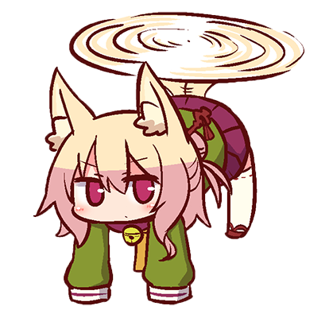
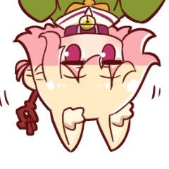

  
  
# 🐱 VencordPlugins
My own list of plugins I made. They're not big since I have other projects that I work on, but I'm gonna make some in future.

> [!NOTE]
> Third party plugins are **NOT** supported by Vencord developers and you should proceed with caution when using them! Also please **do not ask them for help with custom plugins, it will get you most likely muted**.

> [!CAUTION]  
> [Vencord](https://github.com/Vendicated/Vencord) is a mod for Discord which breaks TOS, though Discord doesn't ban for it. If you really care about your account then better don't use it.

## 💻 Plugins included:

-   [remixMe](https://github.com/meowabyte/remixMe/) - Adds **REMIX** tag to every message of your that has any sort of attachment, not only image.
-   [meowmrrp](https://github.com/meowabyte/meowmrrp/) - Sends phrases like `meow` or `mrrp` on your current chat with reasonable delay. (More about how it works in plugin's settings)

## 💬 Upcoming Plugins:

`-`

## ❌ Removed Plugins (+ reason):

-   noAppsAllowed - Useless + easily breakable plugin. You can easily find a CSS snippet that replaces this.
-   betterQuests - Unusable - would crash Discord on start with it, since that time Discord already put quests in a _bit_ better place (`Discover > Quests`)

## ❔ How to get those plugins?

1. Create folder `userplugins` in `Vencord/src` directory.
2. Inside the folder execute this command. (You're gonna need `git` for it.)

```bash
$ git clone --recursive https://github.com/meowabyte/VencordPlugins
```

3. All plugins made by me should be available now!

_If you want to find out how to install single plugin please go to [specific plugin's repo](plugins/)_

## ❔ How to start with installing third party plugins?

You need to clone Vencord repo and compile it with your userplugins yourself. Take a look at this guide.  
https://docs.vencord.dev/installing/custom-plugins/

## 📌 License

This repo as well as all plugins included in it follow MIT license. The file can be found [here (/LICENSE)](/LICENSE).


